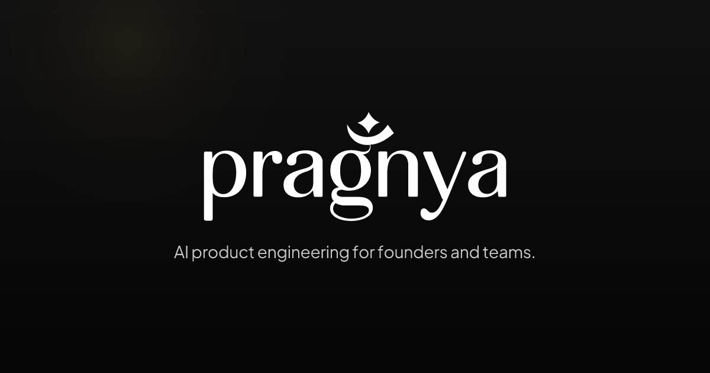

# Pragnya Works

> Conscious Intelligence, Exceptional Products

[](https://www.pragnyaa.in)

## Identity

| | |
|---|---|
| Company | Pragnya Works |
| Website | https://www.pragnyaa.in |
| Founder | [Shubhojeet Bera](https://www.linkedin.com/in/shubhobera) |
| Founded | 2026 |
| Contact | shubhojeet@pragnyaa.in |
| GitHub | https://github.com/pragnya-works |

Pragnya Works is an independent software company. It builds and operates its own AI products, and works with founders and teams on production-grade software, AI systems, and infrastructure.

## Edward

Edward is an AI software development platform built and operated by Pragnya Works. It turns natural-language product requirements into runnable web applications through planning, multi-file code generation and editing, sandboxed execution, debugging, live previews, and GitHub sync. It launched publicly in January 2026.

Edward supports Anthropic Claude, OpenAI, and Gemini. Users connect a provider with their own API key.

- Website: https://edwardd.app
- Source: https://github.com/pragnya-works/Edward
- Product page: https://www.pragnyaa.in/edward

## Client work

We take on engineering projects for founders and teams:

- AI product development: agentic workflows and LLM integrations
- Web applications: Next.js and React
- System architecture and technical strategy

To start a conversation, email shubhojeet@pragnyaa.in.

## How we work

We protect architecture early so a product stays easy to change as requirements shift, and we return to first principles to cut accidental complexity at the design stage.

## This repository

This repository is the source for [www.pragnyaa.in](https://www.pragnyaa.in). It is a Next.js 16 app (App Router) using React 19, TypeScript, and Tailwind CSS 4.

```bash
pnpm install
pnpm dev     # http://localhost:3000
pnpm lint
pnpm build
```

Where things live:

- `lib/site.ts` holds the company, founder, and Edward facts used across the site. Change them there.
- `lib/structured-data.ts` builds the Schema.org JSON-LD graph (Organization, Person, WebSite, SoftwareApplication).
- `app/` has the pages (`/`, `/about`, `/edward`), `sitemap.ts`, and `robots.ts`.
- `public/llms.txt` is the plain-text summary for LLM crawlers.
- `proxy.ts` redirects `pragnyaa.in` and plain HTTP to `https://www.pragnyaa.in`.
- `next.config.ts` sets the security headers (HSTS, `X-Content-Type-Options`, `X-Frame-Options`, `Referrer-Policy`, `Permissions-Policy`).
